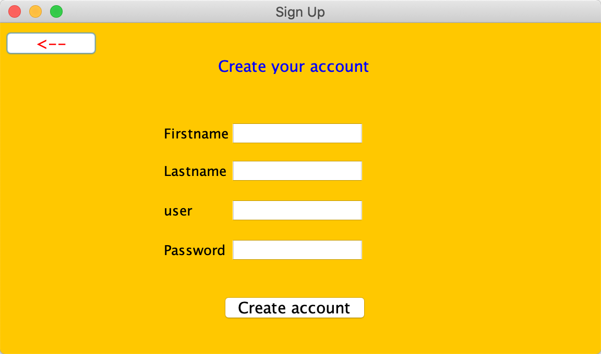
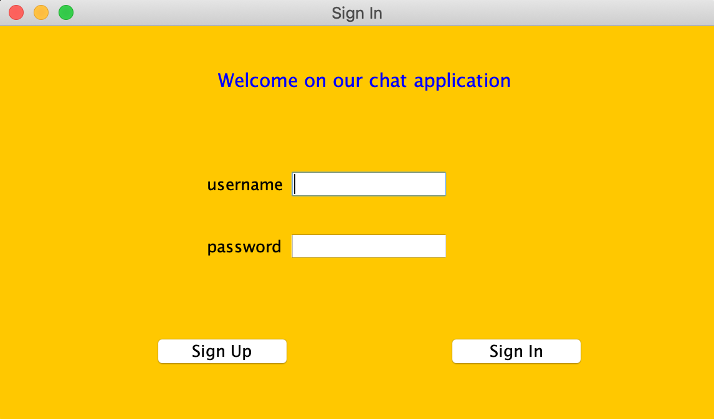
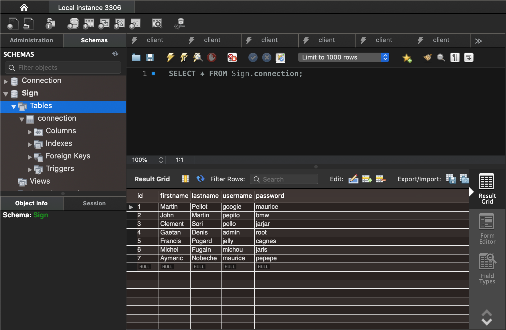
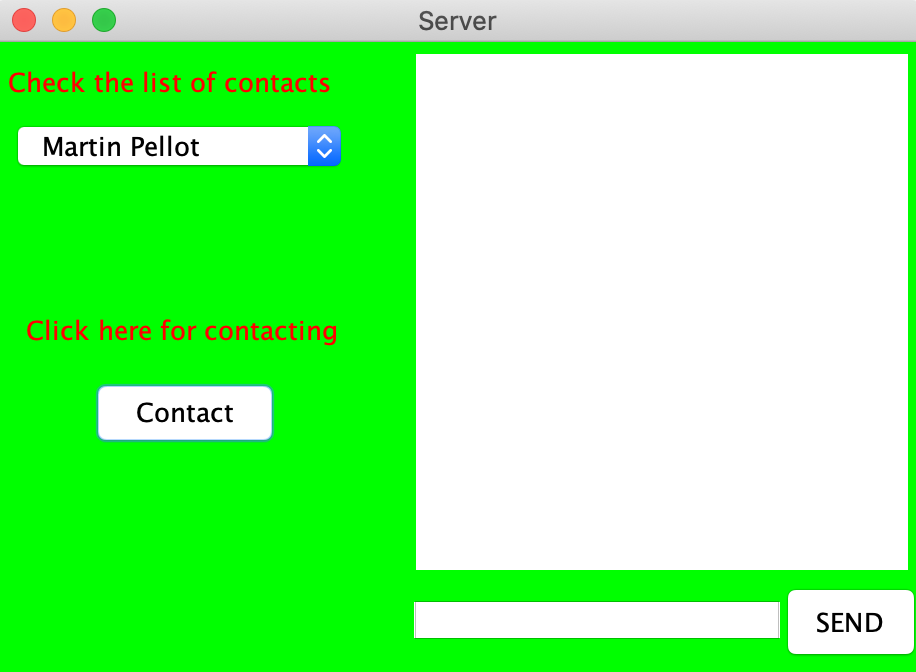
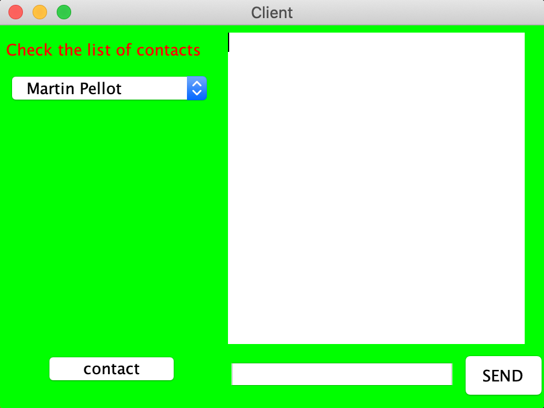

# Projet GLPOO

Cette application a été développée afin de permettre à plusieurs clients de converser entre eux.

## Présentation des membres avec les pseudos git correspondant de chacun

Le groupe est composé de six membres : Léo CALIS (Amscray), Étienne ROCHE (Frizzby), Thibaut ALLAIN (centurion6521),
Martin RAYNAUD (Martini), Clément SOREL (Clem10101998), Paul-Amaury KLEIN (Slabons).

## Présentation du projet

Nous avons une première interface qui permet au client de se connecter à l’application. Si la connexion est un succès,
une fenêtre « Server » et « Client » s’ouvrent. L’utilisateur peut ensuite voir la liste des contacts sur « Server » avec qui
il souhaiterait communiquer. Dans le cas où la connexion du client à l’application est un échec, il peut utiliser le bouton 
« Sign Up », qui lui permet de créer son compte. Une fois que tous les champs présentés sont remplis, le client n’a plus qu’à 
cliquer sur le bouton « Create account ». Cette action viendra enregistrer le nouveau client à une base de données. 
Notre base de données a été créée avec MySQL Workbench. Les données traitées sur cette base sont les suivantes :id, 
firstname, lastname, username, password. Celles-ci correspondent aux données personnelles de chaque client.

## Prérequis

- Installation d'Eclipse
- Installation de MySQL Worbench

## Fonctionnalités (GUI)

### Connexion à l'application

### Création d'un nouveau compte client

### Schéma utilisé pour la JDBC

### Messagerie Serveur

### Messagerie Client

